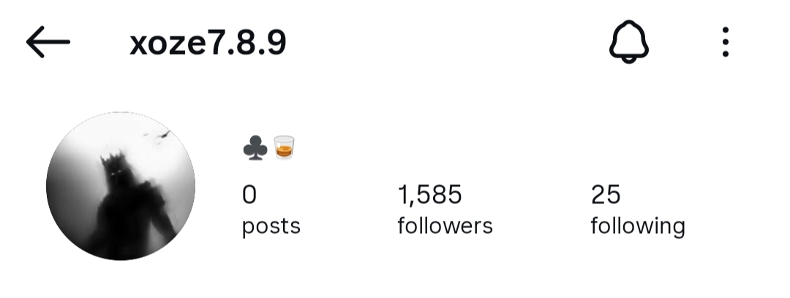

<div align="center">



# **ACCEND-365**

### *A 365-Day Sovereign Self-Mastery Protocol*

---

**Transform who you are, one disciplined day at a time.**

---

</div>

<div align="center">

# **The Idea**

The vision for ACCEND was conceived by


# **[ @xoze7.8.9 ](https://www.instagram.com/xoze7.8.9?stkn=c2I2NnI2NXJjM3Vn)**

### *Creator & Original Idea*

**All credit for the concept goes to him — we only built it.**

---

[](https://github.com/elias-veyne/ACCEND-365/releases)
[](LICENSE)
[](https://github.com/elias-veyne/ACCEND-365/releases)

</div>

---

## What Makes It Different

|  |  |
|--|--|
| **Real Cloud Data** | Profiles, XP, and completions sync to Firebase Firestore. Compete against actual users, not bots. |
| **Four Pillars** | Physical, Mental, Skills, and Social — every dimension of growth tracked independently. |
| **Cinematic Loading** | A golden particle-splash screen with ambient audio on every launch. |
| **Live Leaderboard** | See your standing across the entire ACCEND cohort, filterable by All-Time and Friends. |
| **Daily Quotations** | A fresh stoic quote every day to set the right tone before you begin. |
| **Progression Ring** | A visual arc on your dashboard showing how far you have come today. |

---

## Features

- **365-Day Protocol** with per-pillar daily tasks, EXP, levels and unlockable titles
- **Home Dashboard** — daily tasks, progression ring, daily quote, four pillar cards
- **Task Completion Rewards** — XP animation, sound effect, level-up celebrations
- **Analysis** — heatmap and per-pillar completion statistics
- **Leaderboard** — live cloud cohort standings with All-Time and Friends filters
- **Cloud Sync** — real user profiles synced to ACCEND Cloud, restorable on fresh install
- **Ambient Audio** — background music loop, notification sounds, loading-screen audio
- **Settings** — notification preferences, pillar muting, cloud sync controls
- **On-Device Reminders** with morning and evening toggle support

---

## Tech Stack

- **Language** — Kotlin
- **UI** — Jetpack Compose with Material 3
- **Database** — Room (offline-first local storage)
- **Backend** — Firebase Firestore (real-time user data and leaderboard)
- **Auth** — Firebase Anonymous Auth
- **Media** — MediaPlayer + SoundPool (ambient music, SFX)
- **Build** — GitHub Actions with signed release APK

---

## Getting Started

Clone the repo and build locally (requires Android SDK 35 + JDK 17):

```bash
git clone https://github.com/elias-veyne/ACCEND-365.git
cd ACCEND-365
./gradlew assembleDebug
```

Or grab the latest signed APK from [Releases](https://github.com/elias-veyne/ACCEND-365/releases).

---

## Built With

<p align="center">
  
  
  
  
  
</p>

---

<div align="center">

**One day. One task. One level. Repeat for 365.**

</div>
